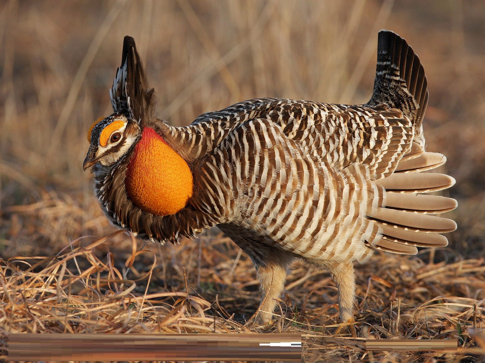
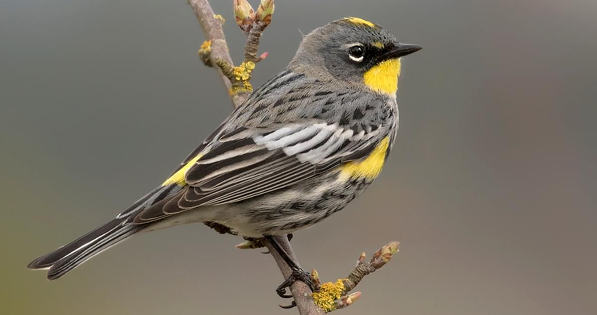

```{r global_options, include=FALSE}
knitr::opts_chunk$set(fig.pos = 'H')
```

# Introduction
|         Birds are a widely dispersed, ecologically-important class with large phenotypic and morphometric diversity (Rosenberg et al 2019). There is no better illustration of bird diversity than body mass, which ranges from the tiny two gram Bee Hummingbird to the Ostrich which is 40,000 times heavier. Understanding bird body mass is critical to understanding avian physiology, ecology, life history, and evolution.

|         Body mass measurements of birds can be applied in a variety of studies. From an ecological standpoint, body mass was found to be a strong predictor of migratory bird distributions when crossing the Gulf of Mexico (Buler et al 2017). Avian body mass is also critical to their physiology and life history; body mass has been used as a proxy for flight speed and predation risk (Veasy et al 1998). Avian body masses are also important in the study of evolution; a study of bird body masses showed that the evolution of body masses is nonrandom and is constrained by the ability of indivdiuals to turn resources into offspring (Maurer 1998). Body mass prediction using statistical methods is also of interest. Similar regression approaches to the one presented in this project used extant bird morphometric features to estimate body masses and ecological features of extinct flying organisms (Field et al 2013). Thus, study of body mass and developing statistical methods for avian body mass prediction can provide useful physiological and ecological information about extant or extinct birds.

|         Presented here is a multiple regression approach to predict bird masses from morphometric, fecundity, and behavioral data sourced from textbooks on bird faunas from geographical regions with the best available ecology and behavioral data available. The model presented in this project could be useful to fill the data gap in newly discovered, difficult to capture birds, or extinct birds.

|         I hypothesize that there will be a strong, linear relationship between body mass and morphometric predictors, characterized by high $R^2$ and strong predictions. I anticipate that morphometric predictors will dominate the model, and fecundity and behavioral predictors will be ancillary.

|         In the Methods section, I will discuss the data processing steps (including changing variable encodings, NA and outlier filtering, and variable transformations informed by Box-Cox and diagnostic plots). In the Results section, I will discuss the model selection process, my model of choice, model performance, and application a couple of my favorite birds. Lastly, in the Conclusions section, I will summarize and contextualize my findings and provide possible improvements to this project.

# Methods
|         The dataset used is available through the Ecological Archives (Lislevand et al, 2007). In the original dataset, variables were encoded by sex (e.g. wing length was encoded in three variables 'M_wing', 'F_wing', and 'U_wing' to denote wing lengths of male, female, and unknown sexes). I changed the encoding by collapsing all wing variables into one column called 'wing' and creating another variable called 'sex' to store the sex of each bird. The resulting dataframe had 11,403 rows and 13 columns.

|         I filtered this dataset for complete cases, so I could exclude rows with missing values for potentially important predictors from the analysis. The dataframe containing complete cases contained 713 entries representing 360 unique species. The resulting dataframe contained the following variables: Family (Numbering of families according to the listing of all bird families in Monroe and Sibley (1997)), Species name (latin), English name (common name), body mass (grams), wing length (mm), tarsus length (mm), bill length (mm), tail length (mm), Clutch Size (average or range midpoint of number of eggs per clutch), Egg_mass (grams), Mating_System (scale of 1-5 ranging from polandry to promiscuity), Display (scale of 1-5 ranging from ground display to aerial display).

|         A full model was fit, and the Box-Cox method was applied to the full model to inform transformations of the response variable. Box-Cox which suggested a log transformation of the body mass. Plots of all numerical predictors and the transformed response variable were generated (Figure 1), and some morphometric predictors (wing, egg mass, tarsus, bill, tail) were log-transformed to attain linear relationships between predictors and response. I believe that these transformations of the predictor variables were warranted because morphometric measurements should be on the same scale.

|         The regression assumption of identical, independent samples may be minorly violated in this project. These data represent mean morphological/fecundity/behavioral characteristics of different bird species; these mean traits have different variabilities depending on the sample sizes of birds collected for each species. What's more, the model was fit to the data set's complete cases, which likely overrepresent birds with well-documented physiologies, life histories, and ecologies. The fact that over 10,000 rows were removed by NA filtering may pose challenges to applying this model to little-studied species, as they may have been excluded from the filtering step.

|         9 birds were removed from the analysis post hoc, as they were outliers with high leverage that may be skewing the model. I verified that these species were morphologically unusual before exclusion: they included 2 species of crane (Brolga and common Crane), 1 species of penguin (Yellow-eyed Penguin), 1 species of hummingbird (Ruby-throated Hummingbird), and 1 species of songbird (Superb Lyrebird).

```{r, eval=T, echo=F, cache=T, include=F}
library(tidyverse)
library(MASS)
library(DAAG)
file<-("avian_ssd_jan07.txt")

#eliminate -999 NA values
data <- read.delim(file, sep="\t", header=TRUE, na.strings =c("-999", "-999.0"))
data[data==-999]<-NA

bird_characteristics<- data %>% dplyr::select(Family, Species_name, English_name, M_mass, F_mass, unsexed_mass, M_wing, F_wing, Unsexed_wing, M_tarsus, F_tarsus, Unsexed_tarsus, M_bill, F_bill, Unsexed_bill, M_tail, F_tail, Unsexed_tail, Clutch_size, Egg_mass, Mating_System, Display)

tmp1<-bird_characteristics %>% dplyr::select(Family, Species_name, English_name, contains("M_"), Clutch_size, Egg_mass, Mating_System, Display) %>% mutate(sex="M")
colnames(tmp1)<- gsub("M_", "", colnames(tmp1))
tmp2<-bird_characteristics %>% dplyr::select(Family, Species_name, English_name, contains("F_"), Clutch_size, Egg_mass, Mating_System, Display) %>% mutate(sex="F")
colnames(tmp2)<- gsub("F_", "", colnames(tmp2))
tmp3<-bird_characteristics %>% dplyr::select(Family, Species_name, English_name, contains("Unsexed_"), Clutch_size, Egg_mass, Mating_System, Display) %>% mutate(sex="U")
colnames(tmp3)<- gsub("Unsexed_|unsexed_", "", colnames(tmp3))

bird_charac_encode<-rbind(tmp1, tmp2, tmp3)
bird_charac_encode$Display<-as.factor(bird_charac_encode$Display)
bird_charac_encode$Mating_System<-as.factor(bird_charac_encode$Mating_System)
bird_charac_encode$sex<-as.factor(bird_charac_encode$sex)
bird_charac_encode$Family<-as.factor(bird_charac_encode$Family)


#get complete cases
bird_data<-bird_charac_encode[complete.cases(bird_charac_encode),]

#fit full model and run summary of fit
fit<-lm(mass~. -Species_name -English_name -Family, data=bird_data)
summary(fit)
layout(matrix(c(1,2,3,4),2,2))
plot(fit)
#Note normality of residuals may be a problem
```

```{r BOX COX, echo=F, eval=T, cache=T, message=F, include=F}
#run boxcox and notice that lambda=0 suggesting log transformation of response
boxcox(fit, data=bird_data)
```

```{r box-cox transform diagnostics and outlier removal, eval=T, echo=F, cache=T, include=F}
box_fit<-lm(log(mass)~. -Species_name -English_name -Family, data=bird_data)
layout(matrix(c(1,2,3,4),2,2))
plot(box_fit)

#####
#Removing outliers
#####

#Outlying indivduals on Residuals vs Fitted and Residuals vs Leverage Plot are very large birds with unusual shapes (cranes & penguins), so we will omit these from the data we use to build the model

bird_data_edit<-bird_data[! rownames(bird_data) %in% c("1019", "1014", "4815", "5473", "1672", "4820", "4582", "781", "1819"),]

new_box_fit<-lm(log(mass)~. -Species_name -English_name -Family, data=bird_data_edit)
layout(matrix(c(1,2,3,4),2,2))
plot(new_box_fit)
```

```{r, message=FALSE, echo=F, eval=T, cache=T, fig.width=5, fig.height=3.5, fig.align="center", fig.cap="Plots of Transformed and Untransformed Predictors and Log Body Mass"}
#####
#Model Selection
######

#####
#Transformations of Explanatory Variables
#####
library(lattice)
library(gridExtra)
library(grid)

#LOG WING. wing and mass have 1-1 relationship so makes sense to log wing
p1<-ggplot(bird_data_edit)+geom_point(aes(x=log(wing), y=log(mass)), size=0.5)+geom_smooth(aes(x=log(wing), y=log(mass)))
#LOG Egg_mass
p2<-ggplot(bird_data_edit)+geom_point(aes(x=log(Egg_mass), y=log(mass)), size=0.5)+geom_smooth(aes(x=log(Egg_mass), y=log(mass)))
#LOG Tarsus figure out which are outliers and consider blocking out outliers
p3<-ggplot(bird_data_edit)+geom_point(aes(x=log(tarsus), y=log(mass)), size=0.5)+geom_smooth(aes(x=log(tarsus), y=log(mass)))
#LEAVE CLUTCH SIZE leave untransformed and understand how the different birds fit different niches
p4<-ggplot(bird_data_edit)+geom_point(aes(x=Clutch_size, y=log(mass)), size=0.5)+geom_smooth(aes(x=Clutch_size, y=log(mass)))
#LOG BILL
p5<-ggplot(bird_data_edit)+geom_point(aes(x=log(bill), y=log(mass)), size=0.5)+geom_smooth(aes(x=log(bill), y=log(mass)))
#LEAVE TAIL
p6<-ggplot(bird_data_edit)+geom_point(aes(x=log(tail), y=log(mass)), size=0.5)+geom_smooth(aes(x=log(tail), y=log(mass)))
grid.arrange(p1, p2, p3, p4, p5, p6, ncol=3)
```

# Analysis
|         I conducted several model selection procedures including comparison of nested models using ANOVA, AIC, and Lasso regression. The nested model ANOVA approach suggested a model with 6 significant predictors (logwing, logegg, logtarsus, Clutch_size, Display, and tail). The AIC approach generated a model with 7 predictors (the 6 from ANOVA plus Mating_system). The LASSO approach suggested a model with 7 predictors (the 7 from AIC).

```{r eval=T, cache=T, echo=F, cache=T, include=F}
#####
#Transform variables for model
#####
bird_data_transform<-bird_data %>% mutate(logmass=log(mass)) %>% mutate(logwing=log(wing)) %>% mutate(logegg=log(Egg_mass)) %>% mutate(logtarsus=log(tarsus)) %>% mutate(logbill=log(bill)) %>% mutate(logtail=log(tail))

#full model
fit_t<-lm(logmass~logwing+logegg+logtarsus+logbill+logtail+Clutch_size+Mating_System+Display+sex, data=bird_data_transform)
summary(fit_t)


####
#Vbl importance
####
library(caret)
vblimp<-varImp(fit_t, scale = TRUE)
vblimp$Overall<-sort(vblimp$Overall, decreasing=TRUE)
vblimp$vbl<-factor(rownames(vblimp), levels=rownames(vblimp)) 

ggplot(vblimp)+geom_bar(aes(x=vbl, y=Overall), stat="identity")+ggtitle("Variable Importance")+theme(axis.text.x = element_text(angle = 90, hjust = 1))+ylab("Vbl Importance (|t|)")
```

```{r ANOVA, eval=T, cache=T, echo=F, cache=T, include=F}
######
#Transform Predictors
#######

########
#ANOVA Comparison of nested models
########

#start with very significant variables from full model and step through
fit1<-lm(logmass~logegg, data=bird_data_transform)
summary(fit1)

fit2<-lm(logmass~logwing+logegg, data=bird_data_transform)
summary(fit2)
anova(fit2, fit1)

fit3<-lm(logmass~logwing+logegg+logtarsus, data=bird_data_transform)
summary(fit3)
anova(fit3, fit2)

fit4<-lm(logmass~logwing+logegg+logtarsus+Clutch_size, data=bird_data_transform)
summary(fit4)
anova(fit4, fit3)

fit5<-lm(logmass~logwing+logegg+logtarsus+Clutch_size+logtail, data=bird_data_transform)
summary(fit5)
anova(fit5, fit4)

fit6<-lm(logmass~logwing+logegg+logtarsus+Clutch_size+logtail+Display, data=bird_data_transform)
summary(fit6)
anova(fit6, fit5)

fit7<-lm(logmass~logwing+logegg+logtarsus+Clutch_size+logtail+Display+logbill, data=bird_data_transform)
summary(fit7)
anova(fit7, fit6)

fit8<-lm(logmass~logwing+logegg+logtarsus+Clutch_size+logtail+Display+logbill+Mating_System, data=bird_data_transform)
summary(fit8)
anova(fit8, fit7)
```

```{r AIC, message=FALSE, echo=F, eval=T, cache=T, include=F}
#####
#AIC for model selection
#####
#Use Akaike's Information Criterion to for model selection
AIC_fit<-stepAIC(fit_t, direction="backward")
summary(AIC_fit)

###AIC yields 7 variable model
###ANOVA and CV yield 6 variable model
```

```{r LASSO, eval=T, cache=T, echo=F, cache=T, include=F}
library(glmnet)

x_vars <- model.matrix(logmass~logwing+logegg+logtarsus+logbill+logtail+Clutch_size+Mating_System+Display+sex, bird_data_transform)
y_var <- bird_data_transform$logmass

lambda_seq <- 10^seq(2, -2, by = -.1)

set.seed(86)
train = sample(1:nrow(x_vars), nrow(x_vars)/2)
x_test = (-train)
y_test = y_var[x_test]

cv_output <- cv.glmnet(x_vars[train,], y_var[train], 
            alpha = 1, lambda = lambda_seq)

best_lam <- cv_output$lambda.min
best_lam

lasso_best <- glmnet(x_vars[train,], y_var[train], alpha = 1, lambda = best_lam)
coef(lasso_best)
```

|         To include model performance in my selection criteria, I conducted 7-fold Cross Validation (i.e. about 100 observations in each fold) and calculated CV error for each model (Figure 2). As illustrated in the plot, CV error was minimized by the 6 variable model. Given this result, I capped the number of predictors at 6, and excluded the larger models suggested by AIC and LASSO as their higher complexity did not result in improved performance.

```{r CV Error, message=FALSE, echo=F, eval=T, cache=T, results="hide", fig.keep="last", fig.cap="7-fold CV error of different sized models", fig.height=3.5, fig.width=5}
set.seed(11)
CV_error_vec<-c()
modellist<-list(fit1, fit2, fit3, fit4, fit5, fit6, fit7, fit8, fit_t)
for (i in 1:length(modellist)){
  a<-cv.lm(bird_data_transform, modellist[[i]], m=7, plotit=FALSE, seed=47)
  CV_error=sqrt(sum((a$cv-a$logmass)^2)/nrow(a))
  CV_error_vec<-c(CV_error_vec, CV_error)
}

plot(CV_error_vec, type="b", main="Effect of number of predictors on 7-fold CV Error", xlab="Number of Variables", ylab="CV Error", col="blue")
abline(h=min(CV_error_vec), col="red", lty=2)
```

|         The final step of my model selection criteria was performance on independent observations. I revisited the original dataset and filtered for test cases (i.e. cases not included in the training data) that were complete for the 6 variables that my largest model was built on. This generated 715 cases to test my model performance. Then using models built on 1 through 6 predictors, I generated predictions for each case and calculated the squared error. The 3 variable model minimized the mean squared error for this independent test set (Figure 3).

```{r Independent Test Set Error, echo=F, message=FALSE, eval=T, results="hide", fig.keep="last", fig.cap="Prediction Error on Independent Test Set of Models Different Size Models", fig.height=3.5, fig.width=5}
####
#build test data set
####
library(tidyverse)
test<-bird_charac_encode[complete.cases(bird_charac_encode)==FALSE,]
test<-test %>% dplyr::select(c(English_name, mass, wing, tarsus, Clutch_size, Display, tail, Egg_mass))
test<-test[complete.cases(test),]
test$logmass<-log(test$mass)
test$logwing<-log(test$wing)
test$logegg<-log(test$Egg_mass)
test$logtarsus<-log(test$tarsus)
test$logtail<-log(test$tail)

result_mat<-matrix(ncol=6, nrow=dim(test)[1])
for (i in 1:dim(test)[1]){
  new_data<-test[i,]
  estimate=exp(predict(fit1, new_data))
  result_mat[i,1]<- (new_data$mass-estimate)^2
  estimate=exp(predict(fit2, new_data))
  result_mat[i,2]<- (new_data$mass-estimate)^2
  estimate=exp(predict(fit3, new_data))
  result_mat[i,3]<- (new_data$mass-estimate)^2
  estimate=exp(predict(fit4, new_data))
  result_mat[i,4]<- (new_data$mass-estimate)^2
  estimate=exp(predict(fit5, new_data))
  result_mat[i,5]<- (new_data$mass-estimate)^2
  estimate=exp(predict(fit6, new_data))
  result_mat[i,6]<- (new_data$mass-estimate)^2
}

head(result_mat)

plot(x=seq(1, 6), colMeans(result_mat), type="b", col="blue", xlab="Number of Variables", ylab="Squared Prediction Error", main="Prediction Error of Independent Obs")
abline(h=min(colMeans(result_mat)), col="red", lty=2)
```

```{r, eval=T, cache=T, echo=F, cache=T, fig.keep=TRUE, results="hide"}
final_model<-fit3
summary(final_model)
```

```{r Prairie Chicken Performance, echo=F, results="hide"}
Sagehen_data<-bird_charac_encode[grep("Prairie-chicken", bird_charac_encode$English_name),]
Sagehen_data<-Sagehen_data[1,]
Sagehen_data$logmass<-log(Sagehen_data$mass)
Sagehen_data$logwing<-log(Sagehen_data$wing)
Sagehen_data$logtarsus<-log(Sagehen_data$tarsus)
Sagehen_data$logegg<-log(Sagehen_data$Egg_mass)
exp(predict(final_model, Sagehen_data))
Sagehen_data$mass
```
```{r Yellow rumped Performance, echo=F, results="hide"}
meadowlark_data<-bird_charac_encode[grep("Yellow-rumped Warbler", bird_charac_encode$English_name),]
meadowlark_data<-meadowlark_data[1,]
meadowlark_data$logmass<-log(meadowlark_data$mass)
meadowlark_data$logwing<-log(meadowlark_data$wing)
meadowlark_data$logtarsus<-log(meadowlark_data$tarsus)
meadowlark_data$logegg<-log(meadowlark_data$Egg_mass)
exp(predict(final_model, meadowlark_data))
meadowlark_data$mass
```

|         Due to the model's relatively parsimonious structure and it's strong performance in CV error and prediction error, the model that I select as my final model is the 3 variable model (logwing, logegg, and logtarsus). The diagnostic plots suggest the regression assumptions are relatively sound (Figure 6 in Supplementary Plots). The flat line on residuals vs fitted and scale-location plot suggest a good linear relationship, albeit the data is slightly heteroskedastic. Larger fitted values correspond to more variability, which makes sense biologically: lighter passerine birds tend to be more similar in structure, whereas heavier birds can assume completely different morphologies (e.g. albatross and emperor penguin). The Normal Q-Q plot suggests the residuals are approximately normal. The Residuals vs Leverage plot shows that no high leverage points are distorting the regression relationship.

{ width=40% }

|         To show how the model works, I selected a row that corresponded to the Greater Prairie Chicken (Figure 4), a close relative of Cecil Sagehen. Using Prairie Chicken's log wing length, log egg mass, and log tarsus length, the model predicted that the Prairie Chicken would have a weight of 369 grams, when the bird had a weight of 993 grams. This underestimation of the bird's weight is somewhat expected, since that the Prairie Chicken is a ground-dwelling bird, and is thus heavier than it's morphology and fecundity data may suggest.

{ width=50% }

|         When the model is applied to a more smaller, more morphometrically standard species, like the Claremont resident Yellow-rumped warbler (Figure 5), our model's prediction improves. Given the morphometric and fecundity data of a Yellow-rumped warbler from our dataset, the model predicted a weight of 15.0 grams, quite close to the true weight of 12.9 grams.

```{r, echo=F, eval=F}
test<-bird_charac_encode[complete.cases(bird_charac_encode)==FALSE,]
test<-test %>% dplyr::select(c(Family, English_name, mass, wing, tarsus, Clutch_size, Egg_mass))
test$logmass<-log(test$mass)
test$logwing<-log(test$wing)
test$logegg<-log(test$Egg_mass)
test$logtarsus<-log(test$tarsus)

test<-test[complete.cases(test),]
test$predict<-exp(predict(final_model, test))
test$resid<-test$predict-test$mass

ggplot(test)+geom_point(aes(x=mass, y=resid, color=Family))+ylim(1500,-5000)+xlim(0,10000)
```

```{r, echo=F, eval=F}
library(rvest)
scraping_wiki <- read_html("https://en.wikipedia.org/wiki/Sibley-Monroe_checklist_1")
scraping_wiki %>%
        html_nodes("h2") %>% html_text()

webpage<-scraping_wiki %>%
        html_nodes("ul") %>% html_text() %>% str_split(pattern="\n")

classes=webpage[[1]][grepl("\\.", webpage[[1]])]

start_index=grep(classes[length(classes)], webpage)[-1]
end_index=grep("Sibley-Monroe checklist", webpage)
bird_vec<-c(rep(NA, length(classes)))
names(bird_vec)<-classes
for (i in start_index:end_index-1){
  bird_vec[i-start_index]<-webpage[i]
}


orders<-str_extract_all(webpage[[1]], "[:digit:]")
mat_f<-cbind(webpage[[1]], orders)
mat_f[lapply(mat_f[,2], length)==1,][,1]

mat_f[lapply(mat_f[,2], length)>1,][,1]

new_vec<-
``` 

# Conclusion

|         Informed by model selection algorithms and performance metrics, I chose a three variable multiple regression model that predicts log bird species mass using log wing length (mm), log egg size (g), and log tarsus length (mm). The data appeared to fit this linear model quite well, albeit larger fitted values were associated with more variability. The model had a high $R^2$ (0.95) and performed well in CV and Independent Test Set predictions. The model is also more interpretable compared to more complex models that incorporated other morphometric, fecundity, and behavioral data.

|         One of this project's major qualitative findings is the importance of fecundity data in predicting bird mass. Intuition might suggest that morphometric data (i.e. data collected from the adult bird itself) would dominate mass prediction. However, log egg mass was found to be the most important variable in the regression analysis (assessed by absolute value of *t* statistics). This affirms the importance of including fecundity data in predictive models of bird mass and also affirms the importance of collection and dissemination of egg data (like at the Natural History Museum in London).

|         In terms of improvements that could be made to this analysis, a more comprehensive dataset with fewer missing values would enable more precise predictions for a wider variety of species, including understudied species that may have been excluded from model building in the data filtering step. One could also consider the a model with a phylogenic interaction term, which allows for the fitting of different $\beta$s for different taxa, this would also enable more precise predictions for morphologically unusual species like cranes, penguins, and hummingbirds.

|         My finding that this model preformed better on smaller, standard shaped birds (like the yellow rumped warbler) than morphologically unusual ones (like the Prairie Chicken) suggests that this model is better suited for mass estimation of certain taxa over others. I began an attempt at grouping together these species into higher level taxonomic groups, so that model performance on different taxa could be assessed. My most immediate next step is to conduct this analysis, and confirm my suspicions that this model is tailored to smaller, morphometrically standard passerines.

# References
Buler, J. J., Lyon, R. J., Smolinsky, J. A., Jr, T. J. Z., Moore, F. R., Lyon, R. J., & Moore, F. R. (2017). Body mass and wing shape explain variability in broad ‑ scale bird species distributions of migratory passerines along an ecological barrier during stopover. Oecologia, 185(2), 205–212. https://doi.org/10.1007/s00442-017-3936-y

Field, D. J., Lynner, C., Brown, C., & Darroch, S. A. F. (2013). Skeletal Correlates for Body Mass Estimation in Modern and Fossil Flying Birds. PLoS ONE, 8(11), 1–13. https://doi.org/10.1371/journal.pone.0082000

Lislevand T., Figuerola J., Székely, T. (2007). Avian body sizes in relation to fecundity, mating system, display behavior, and resource sharing. Ecology 88, 1605.

Maurer, B. A. (1998). The evolution of body size in birds . I . Evidence for non-random diversification. Evolutionary Ecology, 12(1973), 925–934.

Rosenberg, K. V, Dokter, A. M., Blancher, P. J., Sauer, J. R., Smith, A. C., Smith, P. A., … Marra, P. P. (2019). Decline of the North American avifauna. Science, 366 (October), 120–124.

Veasy, J. S., Metcalfe, N. B., Houston, D. C. (1998). A reassessment of the effect of body mass upon flight speed and predation risk in birds. Animal Behaviour, 56(4), 883-889.


# Supplementary Plots

```{r, echo=F, fig.width=8, fig.height=7, fig.cap="Diagnostic Plots for Final 3-vbl Model"}
layout(matrix(c(1,2,3,4),2,2))
plot(final_model)
```

